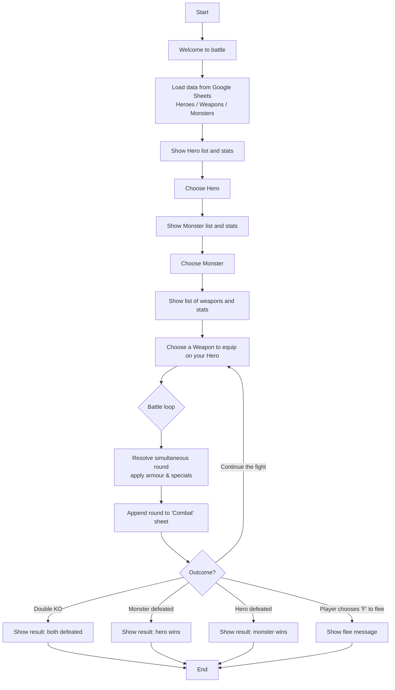

# Python Battle grounds

## Imporvised RPG with turn-base gameplay and data storage

[Python battle grounds](#python-battle-grounds)
 - [Game Overview](#1-game-overview)
    - [1.1 Theme & Inspiration](#11-theme--inspiration)
    - [1.2 Design Goal](#12-design-goals)
 - [2 Game rules](#2-game-rules)
    - [A Battle Round content:](#a-battle-round-consists-of)
 - [3 Characters & Gear](#3-characters--gear)
    - [3.1 Heroes](#31-heroes)
    - [3.2 Monsters](#32-monsters)
    - [3.3 Weapons](#33-weapons)
 - [4 Special abilities in gameplay](#4-special-abilities-in-gameplay)
    - [4.1 Heroes’ special abilities](#41-heroes-special-abilities)
    - [4.2 Monsters’ special abilities](#42-monsters-special-abilities)
    - [4.3 Weapons’ special abilities](#43-weapons-special-abilities)
 - [5 How Combat Works (Detail)](#5-how-combat-works-detail)
    - [5.1 Gameplay flow (Flowchart)](#51-gameplay-flow-flowchart)
    - [5.2 Gameplay flow (Description)](#52-gameplay-flow-description)
    - [Rolls](#rolls)
    - [Armour & Caps](#armour--caps)
    - [Post-Round Effects](#post-round-effects)
    - [Display](#display)
 - [6 Quality](#6-quality)
    - [6.1 Testing](#61-testing)
    - [6.2 Fixed Bugs (highlights)](#62-fixed-bugs-highlights)
 - [7 Google Sheets Integration](#7-google-sheets-integration)
 - [8 Tech Stack](#8-tech-stack)
 - [9 Deployment to Heroku](#9-deployment-to-heroku)
    - [One-time app setup](#one-time-app-setup)
    - [Add buildpacks](#add-buildpacks-order-matters)
    - [Set Config Vars (Settings → Config Vars):](#set-config-vars-settings--config-vars)
    - [Procfile*](#procfile-should-be)
    - [Deploy](#deploy)
 - [10 Known Limitations / Future Ideas](#10-known-limitations--future-ideas)
 - [11 Special requirements from Code Institute](#11-special-requirements-from-code-institute)
    - [11.1 Reminders](#111-reminders)
    - [11.2 Creating the Heroku app](#112-creating-the-heroku-app)
    - [11.3 Constraints](#113-constraints)
 - [12 Credits & Thanks](#12-credits--thanks)
    - [12.1 Credits](#121-credits)
    - [12.2 Thanks](#122-thanks)
 - [13 Final note](#13-final-note)

## 1 Game Overview
### 1.1 *Theme & Inspiration*

Inspired by pen-and-paper RPGs and old-school dungeon crawlers.

Designed around balance: tougher heroes tend to have weaker specials and vice-versa (and similarly for monsters & weapons).

### 1.2 *Design Goals*

Transparent math: every strike prints the rolls and Armour interactions.

Readable log: each round (including “starting state”) is saved to a “Combat tab” (worksheet)in Google Sheets.

Simple, replayable loop: choose hero, weapon, monster → fight → optionally flee.

The player has 10 hero characters and 5 monsters (enemies) to choose from. 
Selection is possible for your heroes, weapons and monsters.
Follow the on-screen instructions and description text to make the selection easier. Then, when combat starts again, follow the printout to see the progress of the battle and decide after each battle round if combat will continue or if your hero disengages.

## 2 Game rules

### *A Battle Round consists of:*

Combat round -> Simultaneous Strikes (Hero ↔ Monster), but using just "regular" attack.

Post-Round Special Effects that can increase, reduce hit points, or have an effect on opponent armour.

The player "controls" only the Hero and can pick weapons to equip the Hero.

Monsters come with "built-in weapons" (claws, fangs, mystical powers)

You can withdraw your hero at the prompt (press any key to continue, or 'F' to flee).
This prompt will show before the new round begins as long as either character (hero and monster) is still standing/alive. 

Damage & Armour are applied per strike. Some weapons/skills ignore or reduce Armour.

HP can go below 0 for both sides (by design), so overkill is visible in logs.

## 3 Characters & Gear
### 3.1 *Heroes*

Hero list: 
*Royal Guard*, *Rogue*, *Assassin*, *Knight*, *Paladin*, Crusader*, *Mage*, *Priest*, *Cleric*, *Druid*

Each hero has: Armour, HP, and an optional Special ability.

### 3.2 *Monsters*

Monsters list: *Vampire, Skeleton, Werewolf, Wraith, Zombie*

Each monster has: Armour, HP, Damage Range, and, in some cases, a Special ability.

### 3.3 *Weapons*

List of weapons: *Spear, Dual daggers, Shadow blade, Flail, Long sword, Axe, Staff, Mace, Whip, Hammer*

Weapons define base damage ranges and sometimes have special rules:

## 4 Special abilities in gameplay

### 4.1 *Heroes’ special abilities*
Royal Guard     ->      *Veteran warrior* - Starts high HP

Rogue       ->      *Quick hands* ability to attack 2 times per round (extra attack)

Assassin       ->      *Deadly poison* Poison damage (2 HP damage if armour was bypassed)

Knight       ->      *Extra Armour* Extra Armour applied

Paladin       ->      *Healing touch* Can heal oneself 1 HP per turn

Crusader       ->      *Destroys undead* Damages undead enemies 1HP per turn (ignores enemy armour)

Mage       ->      *Fireball* 1 fire damage per round (ignores armour)

Priest       ->      *Spectral shield* Hero can take max 1 damage (after armour was bypassed)

Cleric       ->      *Holly might* Takes down enemy armour each round by 1

Druid       ->      *Thorns Shield* Every successful attack on the hero returns 1 damage back to the enemy (ignores enemy armour)

### 4.2 *Monsters’ special abilities*

Vampire     ->      *Drain life* Every sucessfull attack regenerates 1HP to monster

Skeleton     ->      *Armoured* High armour applied 

Werewolf     ->      *Shred armour* Every successful attack reduces hero armour by one.

Wraith    ->     *Ghost shield* Can receive max 1 damage per attack (after armour is bypassed)

Zombie     ->      *Death grip* Does extra 1 damage (ignores hero armour)

### 4.3 *Weapons’ special abilities*

Dual daggers        ->      *Double stab* Attack 2 times (1-3) + (1-3), but armour defence is applied once

Flail        ->      *Spiked ball on chain* -> 0-3 + (0-6)

Axe        ->      *Deep slash* -> Damage (0-4) is multiplied by 2 = (0, 2, 4, 6, 8)

Whip        ->      *Lash me gently* Ignores armour

Hammer        ->      *Shield breaker* -> Destroys 1 armour after each successful attack.

## 5 How Combat Works (Detail)

Combat (game flow) is described through *"flowchart"* and *phase-by-phase* description

### 5.1 Gameplay flow (Flowchart)

### 5.2 Gameplay flow (Description)

#### *Rolls*

Hero: 1 (or 2 due to special ability) strikes

Monster: 1 strike (currently, there are no monsters with dual strike).

#### *Armour & Caps*

Armour is applied per strike using the snapshot armour at strike time. Snapshot is used to display status or armour during the Combat round, as in the next battle round, armour might be reduced.

Caps (Ghost shield/Spectral shield) reduce per strike net damage to 1 (after armour has been applied).

#### *Post-Round Effects*

To see the list of post-round effects, check 

### *Display*

- First lines show combat round - strike math and HP after strikes (before specials).

- Then [Post-round] (when special abilities are applied) notes for each effect.

- Finally, [After effects] lines show final HP/Armour.

## 6 Quality
### 6.1 *Testing*

Manual testing of all heroes, monsters, and weapons to verify:

Testing was done by me and random folks I managed to stop and ask them to give the game a try on my laptop while they drank coffee, hot chocolate, or, in most cases (since I am in Ireland) alcohol, despite it was early morning on a workday.

Bugfixes
Damage math matches printed rolls.

Ghost/Spectral caps apply correctly.

Armour snapshots display the armour used during the strike, not the post-round modified value. (error was that the current armour value was calculated after it was reduced, but shown during the initial combat round)

Hit Points calculated correctly take into account Damage inflicted, armour on the receiving end, total hit points defender has and any special ability that might interfere with Hit Points calculation.

Specials trigger only when conditions are met.
All Relevant special are triggering for corresponding hero, monster and weapon and only when it is needed.

PEP8 validation: pass (via pycodestyle / pep8).

### 6.2 *Fixed Bugs (highlights)*

Immortal Paladin & Vampire interactions resolved.
-> Since it was set that heroes and monsters cannot drop below 0Hit points, Paladin healed himself and Vampire drained life (both for 1HP), triggering that Battle round goes on indefinitely.

Flail extra damage not applied → fixed (reads extra range from text; defaults to 0–6).
-> Fixed in the way how we get the info from the spreadsheet.

Output refinements for Axe (×2 math shown) and Dual Daggers/Flail (show components).
-> a bit confusing in the code and not set properly for when writing the code, but essentially, separated code was done so that dual damage and double damage are not the same (as they shouldn't be).

HP display now shows “after strikes, before specials” and then “after effects.”
-> This is due to not thinking about the need that final Hit Points was displayed, and we had a formatted text showing hit points after combat round (so after the regular attack). That showed, although the math was correct, final amount of hit points was shown before special abilities displayed, making it look like as if the special abilities were not calculating correctly hit points correctly.

Armour shown reflects the armour at the time of each strike (not the post-round value).
-> Similar to hit points, but this was order of writing code. In the formatted string, it displayed already reduced armour, despite deduction will take place in next round and not current one. Math was correct, just display was no in its place.

Several specials originally clamped HP at 0 → now can drop below 0 to show overkill.
-> Decided to drop below 0 Hit points due to Paladin and Vampire abilities, as reviewing from 0 to 1 will keep hero on the monster in play. But reviewing from -3 to -2 will not keep them in play.

Monster damage was using min instead of max in some branches.
-> Copy/paste issue where I forgot to change to max for monster max damage. 

## 7 Google Sheets Integration

The game reads Heroes, Weapons, and Monsters from tabs in a Google Sheet.

All combat rounds are written to a Combat tab with headers:

| Col | Header            | Meaning |
|-----|-------------------|--------|
| A   | Damage done       | hero raw pre-armour |
| B   | Damage inflicted  | hero net → monster after armour/caps |
| C   | Damage received   | monster raw → hero |
| D   | Damage taken      | monster net → hero after armour/caps |
| E   | Hero ability      | text |
| F   | Monster ability   | text |
| G   | Weapon ability    | text |
| H   | Armour Hero       | end of round, after specials |
| I   | Armour Monster    | end of round, after specials |
| J   | Hero HP           | end of round, after specials |
| K   | Monster HP        | end of round, after specials |

A Round 0 row is logged first with starting HP/Armour.

When multiple battles are played, a dashed separator row is added.

Share the sheet with your Google service account email (found in the JSON) so the app can read/write.

I had a fair share of setbacks with this, as I did expose keys not once but twice. I created a new spreadsheet and managed (with the help of kind people from Stack, like *Sophie*, *Hilla* and *Mika*) to remove commits that contained exposed keys without "nuking" entire commit history.

All combat rounds are logged to Google Sheets for tracking &auditing.
##### *https://docs.google.com/spreadsheets/d/1-QrsVmnaWtkZMZV8pu5HJkQnQXWFyk3LPyD9UdntkLI/edit?gid=0#gid=0*

## 8 Tech Stack

Python (game logic, Google Sheets I/O via gspread + google-auth)

Node.js + Express (serves a web terminal UI; Code Institute template)

Heroku (hosting)

Google Sheets API (data source + combat log)

## 9 Deployment to Heroku

### *One-time app setup*

#### *Add buildpacks (order matters):*

Node.js
Python

#### *Set Config Vars (Settings → Config Vars):*

CREDS → I paste the entire Service Account JSON
SHEET_ID was not used despite folks from Stack advised to do so

#### *Procfile* should be:*

web: node index.js

#### Deploy

Despite I found this on YouTube
*heroku login*

*heroku git:remote -a <my-app-name>*

*git push heroku main*

*heroku open*
I decided to go with "confirmed option" and linked the project in Heroku by selecting GitHub > Link the project > Add.

## 10 *Known Limitations / Future Ideas*

I had lots of ideas, but the project is already stretched outside of the time allocated, and folks from Code Institute will not grant me more time, so I had to cut it short.

*- Monsters currently perform 1 strike; multi-strike monsters would be fun

*- Add more abilities with richer conditions*

*- % to hit with some range weapon that would either have greater damage or multiple attacks to balance*

*- stun where monster or hero would skip their next attack chance*

*- prolonged damage where there would be "bleeding wounds" that keep draining HP, or poison that keeps damaging, or fire that keeps burning*

*- lifesteal variants -> where HP would be drained from one character to another (-1 HP for one side and +1 HP for the other side)*

*- cloak of invisibility -> where one side could completely avoid the first attack*

*- smoke bomb -> where damage received would be halved*

*- fury -> next attack does double damage*

*- dark magic -> character loses a certain amount of HP, but does triple damage*

*- blood ritual -> player heals a certain amount of Hit Points, but misses the next round of attack (or next attack does 0 damage)

*- sacrifice -> hurts both hero and monster for the same amount of hit points

*- vengeance -> if hero or monster receives a certain amount of actual damage (after armour reduction), retaliation strikes happen that doesn't count towards regular strikes

*- divine immunity -> character is immune to the effect of any special skills from the enemy or weapons

*- double-edged sword -> weapon that can do high damage to the enemy, but might roll a negative value that can potentially damage the wielder of the weapon

+- trolling staff of pacifist -> weapon that can do huge damage to the enemy, but might also heal the enemy

*-Front-end polish (animations, colour coding for damage/heal/caps).*

## 11 Special requirements from Code Institute

## 11.1 Reminders

- Your code must be placed in the `run.py` file
*(check commit 186 where I moved main module from battle_grounds.py to run.py)*
- Your dependencies must be placed in the `requirements.txt` file
- Do not edit any of the other files, or your code may not deploy properly

## 11.2 Creating the Heroku app

[Check section "Deployment to Heroku"](#9-deployment-to-heroku)
Also ...
[Check section "One-time app setup"](#one-time-app-setup)

***When you create the app, you will need to add two buildpacks from the _Settings_ tab. The ordering is as follows:***

1. `heroku/python`
2. `heroku/nodejs`

[Check section "Add buildpacks"](#add-buildpacks-order-matters)

***You must then create a _Config Var_ called `PORT`. Set this to `8000`***

***If you have credentials, such as in the Love Sandwiches project, you must create another _Config Var_ called `CREDS` and paste the JSON into the value field.***

***Connect your GitHub repository and deploy as normal.***

[Check section "Deploy"](#9-deployment-to-heroku)

## 11.3 Constraints

***The deployment terminal is set to 80 columns by 24 rows. That means that each line of text needs to be 80 characters or less otherwise, it will be wrapped onto a second line.***

This part was not done as game needs to be explained, follow-up text needs to be descriptive, and the game mechanic (despite being simple) is too complex for the average player to understand what is going on.

Those almost mandatory lines would make the game possibly confusing when it comes to 
1. total damage deducted by armour
2. then applying special skills that either reduce or increase health and/or armour
3. on top of some special skills, contracting a regular battle mechanic 

## 12 Credits & Thanks

### 12.1 Credits
Template: Code Institute Python Essentials Template (web terminal).

Nice folks & sanity-saver: you know who you are.

Libraries: gspread, google-auth, Node/Express.

### 12.2 Thanks

- Thanks to folks from Stack Overflow

- Thanks to the person who invented YouTube and a bunch of enthusiastic people sharing their work on YouTube without promoting their channel, or asking for "like" or "subscribe"

- Thanks to random folks in the coffee shop for QAing the game.

- Thanks to my team at work. They are completely useless, so I could write code during working hours and still outperform most of them.

## 13 Final note

This project grew from curiosity into a fully hosted, auditable little battler. Have fun breaking it—and the log will tell you exactly how wild the combat can get. 💥

I especially had so many setbacks with Google Spreadsheet as I have pushed multiple times my key, so I was panicking around to get it removed. Learned finally how to do it

Another pretty insane setback was deploying to Heroku. Error on my part that I didn't read how I should be using the template from Code Institute, but took me a full 2 days to figure out what files I needed to have in order to push/connect the damn thing with GitHub.

In both cases, there were some nice folks on Stack Overflow, like Alvaro, Mika, Asia, Hilla, Jeheeya, and Sophie, who helped me with ideas, suggestions and command lines to try out.

Bless their hearts

